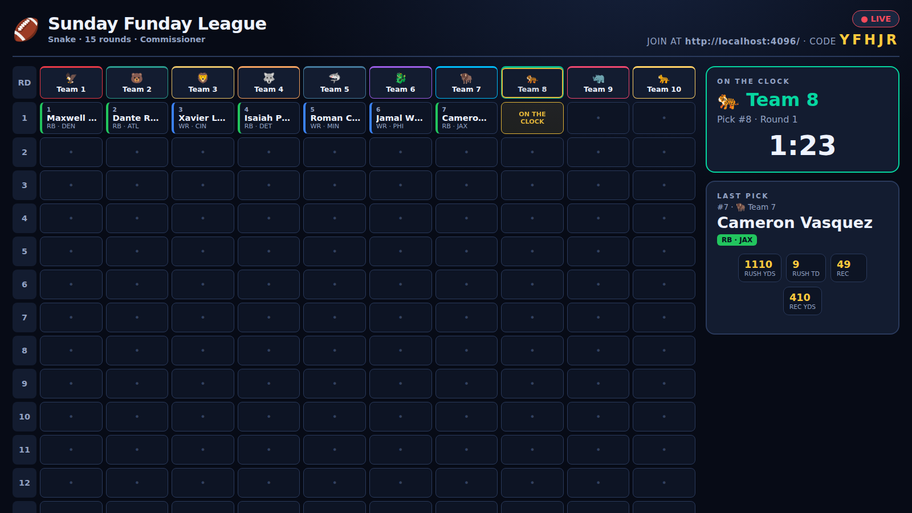

# 🏈 Draft Day Board

A polished, in-person fantasy football **draft day** experience: a big-screen TV
board with dramatic pick reveals, plus phone-based control for the commissioner
and players. Built for the room — the ding goes off, "THE PICK IS IN," and the
selection is revealed like the real NFL Draft.



## Quick start

```bash
npm install
npm run build      # builds client + server
npm start          # serves everything on http://localhost:4000
```

Then, on the same Wi-Fi:

- **TV / big screen:** open `http://<host>:4000/board/<CODE>` (or click *Launch
  Board* from setup). Tap once to enable sound + fullscreen.
- **Commissioner (phone/laptop):** open `http://<host>:4000/`, create a draft,
  and you land on the setup console.
- **Players (phones/iPads):** open `http://<host>:4000/play/<CODE>` (or enter the
  code on the home page) and tap a team to join.

> The board prints the join URL + code on screen for the room.

### Development

```bash
npm run dev        # Vite client (5173) + server (4000) with hot reload
```

Vite proxies `/api` and `/socket.io` to the backend, so use `http://localhost:5173`.

## How it works

| Requirement | Implementation |
|---|---|
| **Big-screen board** | `/board/:code` — draft grid, on-the-clock + countdown, and a **last-pick stats spotlight**. |
| **Two modes** | **Commissioner**: one device makes every pick. **Self-pick**: each player drafts from their phone when on the clock. Toggle in setup (locked once the draft starts). |
| **Full phone setup** | Commissioner console: league name, team names, draft order (reorder / randomize), snake-vs-linear, rounds, seconds-per-pick. |
| **Secure, no accounts** | Capability tokens. An unguessable 5-char join code + crypto-random per-team and admin tokens (`nanoid`). Tokens live in `localStorage` so a refresh keeps your seat; they're never sent to the board or other players. |
| **Confirm + dramatic reveal** | A pick requires one confirmation, then it does **not** pop onto the board. The room hears a **ding**, sees "THE PICK IS IN," then a fanfare + animated player card before it slots into the grid. |

### Architecture

- **Server** (`server/`) — Node + Express + **Socket.IO**. In-memory session
  store (`store.ts`) with disk persistence (`server/data/sessions.json`) for
  restart-resilience, pure draft logic (`draft.ts`), and a 50-player fake
  dataset (`players.ts`). Serves the built client in production.
- **Client** (`client/`) — React + Vite + TypeScript. Routes: `/` (home),
  `/admin/:code` (commissioner), `/board/:code` (TV), `/play/:code` (player).
  Sounds are generated procedurally via the Web Audio API (no asset files).
- **Shared** (`shared/types.d.ts`) — one source of truth for domain + socket
  event types, consumed by both packages.

The server is authoritative: it validates whose turn it is, that a player is
undrafted, and that the actor holds the right token before recording any pick.

## Testing

```bash
npm test            # unit tests (draft logic, store, auth) — 19 tests, Vitest
npm run test:e2e    # full draft over real Socket.IO (server subprocess)
npm run test:browser# headless Chromium drives the real UI + checks the reveal
npm run screenshots # regenerate screenshots/
```

The browser tests require Chromium: `npx playwright install chromium`.

## Notes / future work

This is an MVP with a built-in 50-player test dataset. Live player data, keeper
leagues, auction drafts, trades, and per-player draft links are natural next
steps. Player stats shown are fictional flavor for the reveal spotlight.
